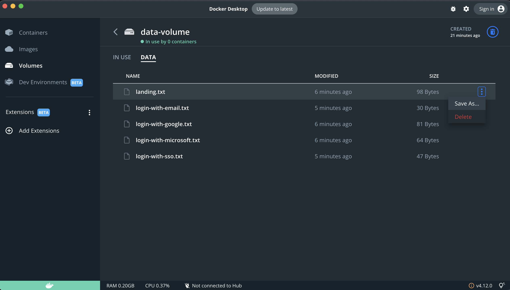

# patricio-ops
Login playground 🪸

1. Create image:

```bash
docker build -t patricio-ops .
```

2. Remove old containers (just in case):

```bash
docker rm patricio-ops
```

3. Run container with volume attached

```bash
docker run --env-file .env -p 3000:3000 --name=patricio-ops --mount 'type=volume,src=data-volume,dst=/usr/src/app/data,volume-driver=local' patricio-ops
```

**Optional:** Inspect the content of the files in the docker volume with Docker Desktop

